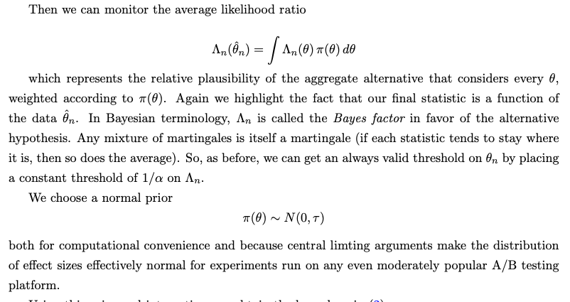
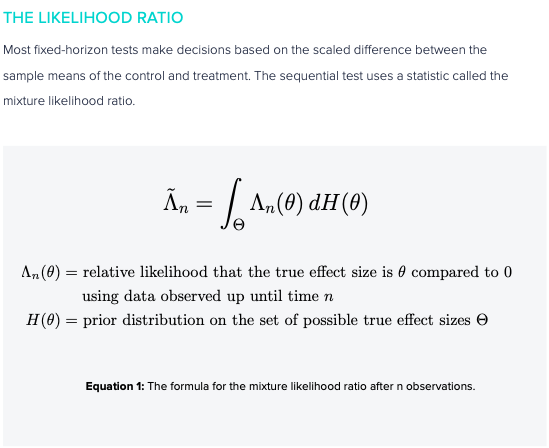

---
layout: post
title: A critique of Optimizely
---   

[Optimizely](https://www.optimizely.com/) is an experimetation platform that offers 2 main services: configuring experiments (traffic splitting, treatment group assignment) and statistical analyses of the configured experiments. Here I outline several limitations, mainly with the analysis part, with using Optimizely.

## Motivations behind Optimizely's statistical methods
Optimizely uses a rather complicated statistical inference process that supposedly allows for continuous monitoring, efficient detection of any treatment effect, while guaranteeing that all inferences made in the process are statistically valid. Several main rationales are given for using such a procedure:
* Users want to monitor their experiments continuously and stop the experiment as soon as some effect is detected. This "peeking" inflates the false positive error rate when traditional statistical methods are used.
* Designing an experiment in the traditional sense (power calculation, sample size calculation, when to look at the results, etc.) is hard and involves too much guessing.

While these motivations sound great on paper, my experience with experimentation systems and experimenters/users reveal that these issues are rather minor.

### Continuous monitoring is overrated
Experimenters are busy people. Regardless of whether they're engineers, product managers, or data scientists, they are most likely juggling multiple code bases, products, and projects. I've never seen anyone who launches an experiment and twiddles their thumbs while it runs, unable to do anything until the experiment is conclusive. The need to continuously monitor the experiment seems to be more imagined than real. I should note that monitoring the experiment for signs that something goes terribly wrong (usually by checking that the main KPIs do not tank) is recommended. But this doesn't require fancy statistics.

### Immediate launch of the winning variant is overrated
Most experiments are not mission-critical, i.e., they're not  going to give a 10% lift to your KPI metrics. A majority of experiments do not show any improvement, and among those that do, the improvements tend to be modest, around the range of 0.5%~2%. While these numbers are only ballpark, they should make sense. Experiments are intended to further optimize the business - they're not meant to fundamentally change the business (there are exceptions). As such, their effects are marginal.

So would experimenters drop everything and launch a winning feature once some positive effect is detected? No. And there are good reasons, statistics and significance aside, for not doing so.
* Since the effects are marginal, waiting for a few more weeks is not a big deal.
* Statistical significance isn't everything. Experimenters want to have a good estimate of the treatment effect. Leaving the experiment to run over the intended duration allows for more data to be gathered, providing more confidence around what the true effect size is.
* Post-hoc analyses of other metrics - there is typically interest in knowing how additional metrics moved, or how certain segments of users behaved. Having more data definitely helps with these analyses. I should note that thorough analysis of important experiments can yield very important and actionable insights into user behavior, which would in turn spur development of additional improvements.

### So what do experimenters really care about?
* The experiment is configured correctly: traffic is being channeled as expected, giving the right ratio of control population size to treatment population size.
* The assignment is as good as random: any checks that can be done to verify that there's no systematic bias between control and treatment groups.
* Removal of pre-existing biases: if there are pre-existing biases (these sometimes happen even when assignment is random), there should be a procedure to remove such biases from final treatment effect estimate.

As far as I can tell (though my knowledge is likely outdated), Optimizely doesn't provide any of these reassuring features.

## Flaws with Optimizely's statistical method
### It is too complicated and not reproducible
A complaint I hear again and again about Optimizely's experiment results is that experimenters don't understand them, and can't reconcile them with their own analysis. Granted that many experimenters are engineers and product managers who aren't statistically savvy, but as many experimenters are data scientists with some statistical training. They would resort to traditional statistics like t-test, Mann Whitney, etc., and see that their results are different from Optimizely's. Alas, they can't really see where Optimizely's numbers come from, because its methods are proprietary.

This above issue is more serious that it sounds. A proponent of Optimizely might say: "Hey - these methods have been developed by experts in the field, statisticians with Ph.D.s, at prestigious universities." But that would have little sway in a product review meeting where the in-house data scientist isn't able to explain the discrepancies, or why some metrics move in this direction whereas others move in the opposite direction. Like I write above, statistical significance isn't everything. Understanding the experiment results, being able to reason about them and therefore trust them, is orders of magnitude more important. 

### Statistical flaws
Now, there is some information about Optimizely's methods that the data scientist can attempt to piece together to try to reproduce. I have included such information I could find in the references section below. After studying these white papers several times over, and I shamelessly admit that I still haven't quite internalized their contributions (I even watched an hour-long YouTube presentation by one of the authors), let me provide a summary of its methods (as far as I can glean from these papers) and some criticisms.

#### Summary
Optimizely uses an inference method that relies on a likelihood ratio test. In a nutshell, it calculates the ratio of (a) the likelihood that the treatment effect $\theta$  is some non-zero value $\tilde \theta$ to (b) the likelihood that the treatment effect is zero. However, ex-ante it is not known what the treatment effect might be, so Optimizely calculates the average likelihood ratio over possible values over a distribution $\pi(\theta)$. It then compares this average likelihood ratio to some threshold that is calibrated to give the right type I error (size, false positive rate), and as much power as possible. 

#### It is Bayesian inference, without the main benefits of Bayesian inference
For a long time I was confused whether Optimizely's methods are frequentist or Bayesian. But it's clear to me now that it is Bayesian in disguise. 

### References

[Optimizely stats engine white paper](https://lechipatrick.github.io/optimizely_stats_engine.pdf)

[Optimizely stats engine brochure](https://lechipatrick.github.io/optimizely_stats_engine_brochure.pdf)

[Always valid p values](https://lechipatrick.github.io/always_valid_p_values.pdf)
